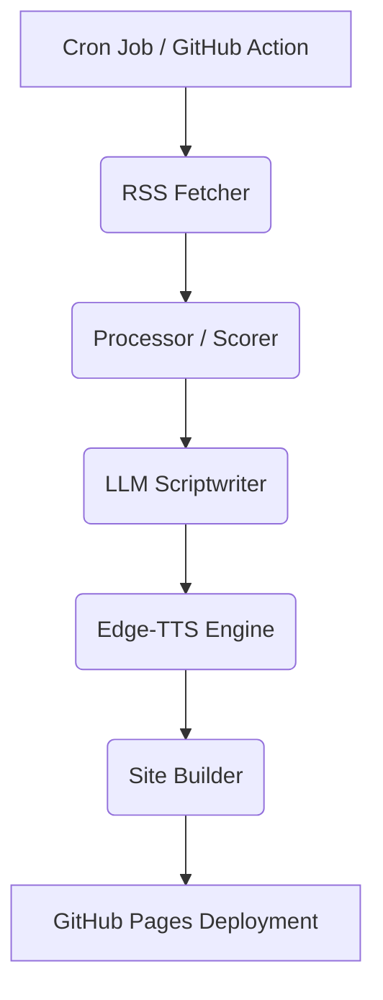

# AI News Podcast: Architecture Overview

This document provides a high-level overview of the `ai-news-podcast` project architecture and how its various components interact.

## System Workflow

The project is designed as a linear pipeline that runs daily. The core workflow is orchestrated by `src/ai_news_podcast/cli/run_daily.py`.

## Core Modules (`src/ai_news_podcast/pipeline`)

### 1. Fetcher (`fetcher.py`)
- **Inputs:** `config/sources.yaml`
- **Responsibilities:**
  - Reads RSS and Atom feeds asynchronously using `httpx`.
  - Extracts full article text using `trafilatura` or `readability-lxml`.
  - Normalizes data into a standard JSON format.

### 2. Processor (`processor.py`)
- **Inputs:** Raw fetched articles.
- **Responsibilities:**
  - Filters out old news and irrelevant topics based on `config.yaml` (`selection.include_keywords`).
  - Deduplicates highly similar articles using TF-IDF and Cosine Similarity (`scikit-learn`).
  - Scores articles based on keyword weights, freshness, and content length to select the top `N` stories for the day.

### 3. Scriptwriter (`scriptwriter.py`)
- **Inputs:** Top scored articles.
- **Responsibilities:**
  - Constructs advanced prompts using the selected articles.
  - Calls external Language Models (OpenAI, Gemini) or local models (Ollama) to summarize the news and generate a conversational podcast script.
  - Formats output into a JSON/Markdown structure for TTS.

### 4. TTS Engine (`tts_engine.py`)
- **Inputs:** Podcast script.
- **Responsibilities:**
  - Synthesizes speech using `edge-tts`.
  - Uses `pydub` to mix the generated speech with background music (`data/assets/bgm_placeholder.wav`).
  - Exports the final mixed audio as an MP3 file.

### 5. Site Builder (`site_builder/`)
- **Inputs:** Generated Audio, Script, and Metadata.
- **Responsibilities:**
  - **`html_gen.py`**: Generates a static HTML page for the daily episode.
  - **`rss_gen.py`**: Updates the podcast XML feed (`docs/feed.xml`) following Apple Podcasts specifications.

## Configuration Layer (`config/`)

- **`config.yaml`**: The central configuration file. It dictates:
  - `llm`: Which model to use and prompt parameters.
  - `tts`: Voice selection and audio mixing settings.
  - `fetch`: Timeout limits and max items per feed.
  - `processing`: Keyword weighting and scoring parameters.
- **`sources.yaml`**: A curated list of RSS feeds (e.g., Hacker News, various AI blogs).

> **Note on Modularity:** The project supports separate profiles. For instance, `config_edu.yaml` and `sources_edu.yaml` are used by the `daily_report_edu.py` script to generate specialized education-focused AI reports, reusing the exact same pipeline but skipping TTS.
