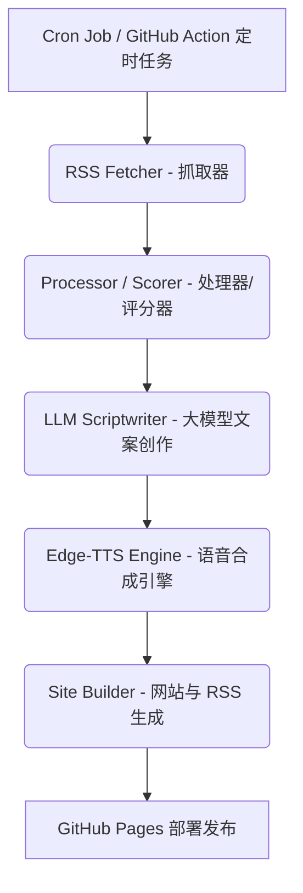

# AI 每日先锋：架构说明

本文档提供了 `ai-news-podcast` 项目的宏观架构概述，以及各个核心组件是如何协同工作的。

## 系统工作流

本项目被设计为一个线性执行的流水线（Pipeline），主要通过每日定时运行来工作。核心流程由 `src/ai_news_podcast/cli/run_daily.py` 调度。



## 核心模块 (`src/ai_news_podcast/pipeline`)

### 1. 抓取器 (`fetcher.py`)
- **输入：** `config/sources.yaml`
- **主要职责：**
  - 使用 `httpx` 异步读取 RSS 和 Atom 订阅源。
  - 使用 `trafilatura` 或 `readability-lxml` 提取新闻文章的全文正文。
  - 将抓取到的数据归一化为标准的 JSON 格式。

### 2. 处理器 (`processor.py`)
- **输入：** 抓取到的海量原始文章数据。
- **主要职责：**
  - 根据 `config.yaml`（如 `selection.include_keywords` 参数）过滤掉旧新闻和不相关的主题。
  - 使用 TF-IDF 和余弦相似度（基于 `scikit-learn`）对高度相似的重复文章进行去重。
  - 基于关键词权重、新鲜度以及内容长度进行混合评分，选出当天的前 `N` 条最有价值的新闻报道。

### 3. 文案创作者 (`scriptwriter.py`)
- **输入：** 评分最高的精选新闻。
- **主要职责：**
  - 提取选定新闻的内容并构建复杂的大模型提示词 (Prompts)。
  - 调用外部大语言模型（如 OpenAI、Gemini）或本地部署的模型（如 Ollama），对新闻进行摘要，并撰写具有对话感的播客文稿。
  - 将生成的输出格式化为供语音引擎使用的结构化 JSON 或 Markdown。

### 4. 语音合成引擎 (`tts_engine.py`)
- **输入：** 播客的文本台本。
- **主要职责：**
  - 使用微软 `edge-tts` 接口进行语音合成。
  - 运用 `pydub` 工具将生成的语音与背景音乐 (`assets/bgm_placeholder.wav`) 进行混音。
  - 导出并压缩最终混合好的 MP3 音频文件。

### 5. 网站与 RSS 生成器 (`site_builder/`)
- **输入：** 生成的音频文件、文本台本和相关元数据。
- **主要职责：**
  - **`html_gen.py`**：为当天的播报生成静态的 HTML 展示页面。
  - **`rss_gen.py`**：生成或更新符合 Apple Podcasts 等平台规范的 XML 订阅源 (`site/feed.xml`)。

## GitHub Actions 与 GitHub Pages 部署

### 两个分支的职责

| 分支 | 内容 | 职责 |
|------|------|------|
| `main` | Python 源码、配置、数据缓存 | 开发与数据存储 |
| `gh-pages` | 纯静态文件（HTML/MP3/XML） | 站点发布，由 pipeline 自动生成 |

### Daily Podcast workflow 触发条件

`.github/workflows/daily.yml` 仅在以下两种情况下触发，**不含 push 触发**：

- **定时触发**：每天 21:43 UTC（北京时间 5:43 AM）
- **手动触发**：在 Actions 页面点击 "Run workflow"，或通过 `gh workflow run` 命令

### 完整运行流程

```
1. checkout          → 拉取 main 分支代码
2. setup-python      → 安装 Python 3.11
3. setup-uv          → 安装 uv 包管理器
4. install ffmpeg    → 安装 ffmpeg（音频处理）
5. uv sync           → 安装 Python 依赖
6. podcast-pipeline  → Stage 1-2: 抓 RSS → 去重 → 聚类 → 评分 → brief JSON
7. podcast-report    → 复用 brief → LLM 生成 Markdown 日报
8. podcast-daily     → Stage 3-5: LLM 写脚本 → TTS 合成音频 → 构建站点 → site/
9. git commit & push → 将 brief/报告/episodes 数据提交回 main 分支
10. gh-pages deploy  → 将 site/ 目录推送到 gh-pages 分支
```

步骤 6-8 是递进关系：7 依赖 6 的 brief，8 依赖 6+7 的数据。

### 数据回写与 [skip ci]

步骤 9 将 `data/episodes.json`、`data/reports/`、`data/briefs/` 提交回 main 分支，供下次运行复用（brief 缓存机制）。commit message 包含 `[skip ci]` 标记，防止将来如果 workflow 增加 push 触发条件时形成循环触发。当前 workflow 没有 push 触发，所以即使不加也不会循环，`[skip ci]` 是防御性写法。

### GitHub Pages 发布链路

```
Daily Podcast workflow 运行
    ↓
步骤 10: peaceiris/actions-gh-pages 将 site/ 推送到 gh-pages 分支
    ↓
GitHub 检测到 gh-pages 分支更新
    ↓
自动触发 pages-build-deployment workflow（GitHub Pages 内置）
    ↓
部署到 CDN，网站更新
    ↓
https://nicekai-jpg.github.io/ai-news-podcast/
```

`pages-build-deployment` 不是用户定义的 workflow，而是 GitHub Pages 服务在仓库 Settings → Pages 中配置了 `gh-pages` 分支后自动生成的内置 workflow。每次 `gh-pages` 分支有更新就会自动触发，负责将静态文件部署到 CDN。

### gh-pages 分支内容

gh-pages 分支是纯产物分支，不需要手动维护，每次 CI 运行都会整体替换：

```
gh-pages/
├── .nojekyll              ← 告诉 GitHub 不使用 Jekyll 处理
├── index.html             ← 首页（播放器 + 日期列表）
├── feed.xml               ← RSS 订阅源
├── episodes/
│   ├── 日期.html          ← 节目详情页
│   ├── 日期.mp3           ← 音频文件
│   └── 日期.txt           ← 脚本文本
├── reports/               ← 日报
├── logo.png
└── pipeline_infographic.png
```

## 配置层 (`config/`)

项目的各类行为均由该目录下的文件控制：
- **`config.yaml`**：核心配置文件。控制内容包括：
  - `llm`：要使用的模型后端及提示词参数。
  - `tts`：语音发音人选择和混音相关设置。
  - `fetch`：网络抓取的超时限制和单源最大拉取数量。
  - `processing`：关键词权重及文章评分算法的参数。
- **`sources.yaml`**：精心挑选的 RSS 新闻源列表（如 Hacker News 及各种 AI 博客源）。
