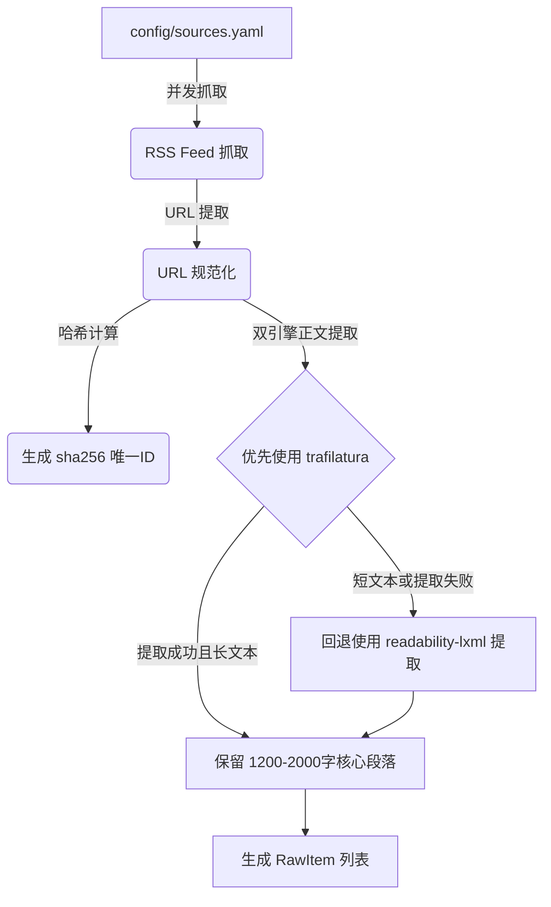
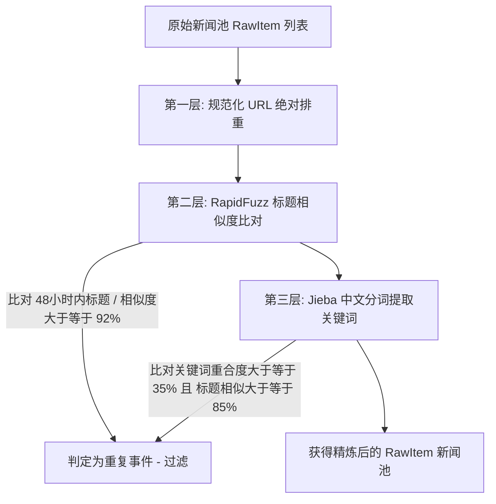
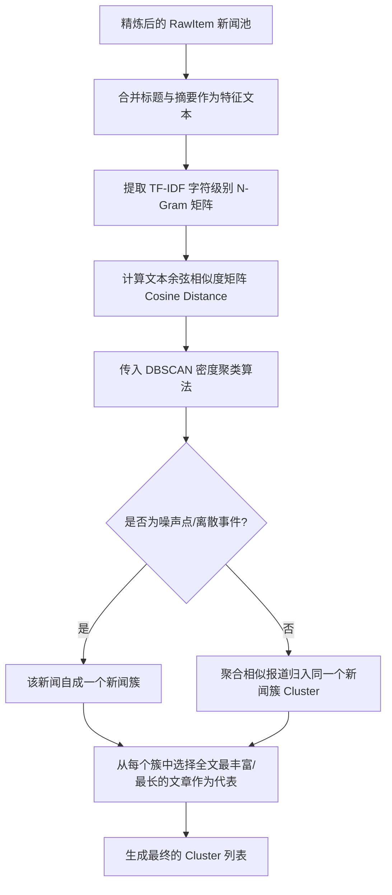
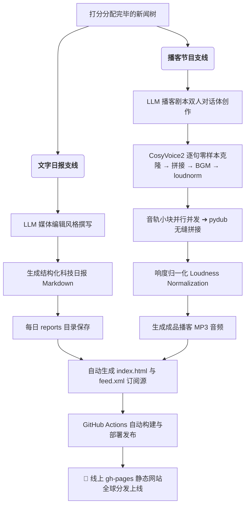

# 🎙️ AI News Podcast 自动化新闻处理管线全景图解

本项目是一个全自动的 AI 前沿资讯整理与播音系统。以下是该系统从“原始资讯抓取”到“全球分发部署”的完整流程图解。

---

## 🎨 系统整体架构流水线 (Overall Architecture Pipeline)

以下是本项目从“资讯抓取”到“全网发布”的端到端整体架构与数据流向流程图：

```mermaid
graph TD
    subgraph "1. 输入配置 (Inputs)"
        Config_Sources[config/sources.yaml<br/>RSS新闻源]
        Config_System[config/config.yaml<br/>系统与打分参数]
    end

    subgraph "2. 核心资讯处理管线 (Core Pipeline)"
        Ingestion[RSS 抓取 & Trafilatura 正文提取]
        Deduplication[三层高精度去重:<br/>URL + Title + Jieba 关键词]
        Clustering[DBSCAN 密度聚类与代表新闻选定]
        Scoring[五维打分模型 & 角色与内容路由决策]
        Generation[LLM 双人对话剧本创作与文字日报生成]
    end

    subgraph "3. 语音合成与构建 (Audio Synthesis & Concat)"
        TTS_Select{TTS 选型映射决策}
        TTS_Local[Edge-TTS GHA 本地合成<br/>(标准旁白/普通文本)]
        TTS_ECS[Tencent Cloud 2C2G ECS<br/>ONNX 队列合成 (情感/中英混读)]
        FFmpeg_Conc[ffmpeg 无损拼接 & loudnorm 响度均衡]
    end

    subgraph "4. 部署与托管 (Distribution & Hosting)"
        Site_Build[静态页面 index.html & feed.xml 生成]
        Publish[GitHub Pages CDN 全球分发]
    end

    Config_Sources & Config_System --> Ingestion
    Ingestion --> Deduplication
    Deduplication --> Clustering
    Clustering --> Scoring
    Scoring --> Generation
    
    Generation -->|文字日报 & 旁白| TTS_Local
    Generation -->|情感/中英混读台词| TTS_Select
    TTS_Select -->|缓存未命中| TTS_ECS
    TTS_Select -->|缓存命中| FFmpeg_Conc
    TTS_Local & TTS_ECS --> FFmpeg_Conc
    FFmpeg_Conc --> Site_Build
    Site_Build --> Publish
```

## 🛠️ 技术实现流程详解 (Flowcharts)

### 1. 资讯抓取与正文提取 (Fetch & Ingestion)

系统每天定时被触发，首先进入资讯获取模块（`fetcher.py`），解析源配置文件并抓取正文：



---

### 2. 三层高精度去重 (Three-Layer Deduplication)

清洗抓取出的新闻池，防止重复话题在同一天里反复提及：



---

### 3. DBSCAN 智能聚类与代表选定 (Clustering)

把分散在不同媒体、不同视角的同类报道智能归为一个“事件簇”：



---

### 4. 五维打分与角色分派 (Scoring & Role Assignment)

给所有筛选出来的事件簇进行多维度量化评估，决定其是否上播或刊登：

```mermaid
graph TB
    subgraph 评分维度 (各项 1-3分)
        A[<b>社会热度</b>: 报道的媒体源数量]
        B[<b>技术创新</b>: 含突破/新模型/开源等词]
        C[<b>信息丰富</b>: 信源长度与细节]
        D[<b>受众相关</b>: AI核心话题与中文支持]
        E[<b>信源权威</b>: 官方博客与学术论文权重高]
    end

    A & B & C & D & E --> F[<b>综合得分 (5-15分)</b>]
    F --> G{划分等级与角色}
    G -->|12-15分| H[🔴 <b>核心主打新闻</b>: 详细拆解剖析]
    G -->|8-11分| I[🟡 <b>支线支撑新闻</b>: 辅助技术印证]
    G -->|5-7分| J[🟢 <b>行业速报简讯</b>: 结尾一句话略过]
    G -->|小于5分| K[⚪ <b>噪音过滤 (Skip)</b>: 软文、广告、水文彻底废弃]
```

---

### 5. 双模同步生成与语音合成 (Script, TTS & Publish)

最后，将角色分配好的新闻事件，通过两条独立的支线进行文字和音频维度的二次创作与部署：



---

## 📌 两个板块的互补定位

* **科技日报 (Tech Report)**：是供用户 **阅读** 的文字载体，适合希望快速预览、浏览具体条目、或者通过点击链接查看原始报道出处的读者。
* **播客节目 (Podcast Episodes)**：是供用户 **聆听** 的音频载体，由两位 AI 主播用轻松的口语化对谈风格来播报，适合通勤、驾车、做家务等“闭眼收听”的场景。
* **双向联动**：我们在主页中将其进行了深度联动，点击任何卡片下的“阅读日报”都可以快速转跳到文字大本营，达成“声文并茂”的立体体验。
