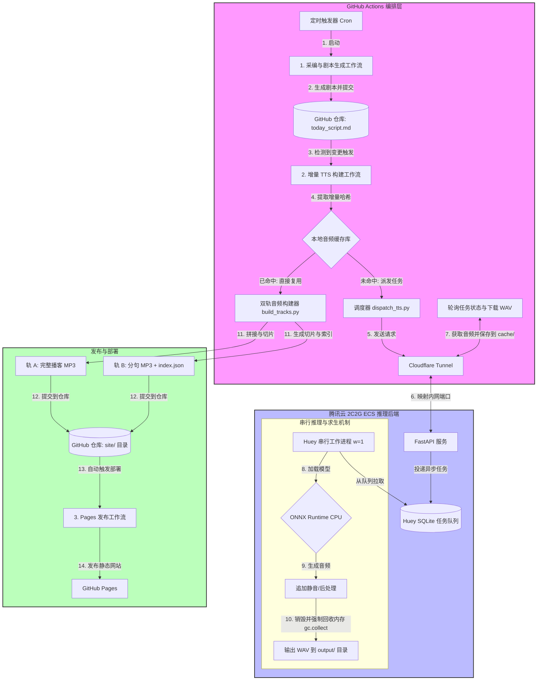

# GHA + 2C2G ECS 多音色音频流水线设计方案

## 1. 整体架构与工作流

本方案将整个系统划分为 **GitHub Actions 编排层** 和 **腾讯云 2C2G ECS 推理后端** 两部分，通过 **Cloudflare Tunnel** 实现安全高效的内网穿透通信。

### 1.1 系统架构图

---

## 2. 核心模块设计

### 2.1 腾讯云 2C2G ECS 推理后端
由于服务器内存仅为 2GB，且没有 GPU，核心设计目标是**内存求生**与**防止 CPU 挤爆**：
- **串行队列机制**：采用单线程 Worker 串行消费任务。无论 GHA 发送多少并发请求，服务器同一时间只进行一个音频片段 of 推理，避免 CPU 过载。
- **显式内存释放**：基于 ONNX Runtime CPU 版本进行推理。当某个模型推理结束时，主动销毁推理 Session 并强制执行系统级垃圾回收（Garbage Collection），防止内存持续上升。
- **Swap 空间保障**：首次配置时为 ECS 划分 4GB 的虚拟内存（Swap Space），当模型加载瞬间内存上升时提供安全缓冲，杜绝 OOM (Out of Memory) 导致的系统崩溃。

### 2.2 情感标签编译器与模型路由
在剧本中，用户可以使用统一的语义 XML 标签进行修饰，编译器在 ECS 侧将它们翻译为底层参数：
- **`<laugh/>` (笑声)**：路由至 ChatTTS 模型，并加载快乐的情感参考声纹，输出更具表现力的 Casual（随性）音频版本。
- **`<sigh/>` (叹气)**：路由至 F5-TTS 模型，并加载哀伤的情感参考声纹，输出 Casual 音频版本。
- **`<pause time="X"/>` (停顿)**：后处理模块解析该标签，直接在生成的音频尾部拼接相应时长的静音片段，不影响模型文本推理。
- **英文单词路由**：若台词中检测到连续英文单词，自动路由至多语言能力较强的 F5-TTS，否则默认路由至常规的 GPT-SoVITS。

### 2.3 GHA 增量哈希对比与缓存
为缩短整体工作流耗时并节省服务器算力，GHA 不会重复合成未改变的台词：
- **台词 MD5 标识**：GHA 会将“说话人 + 台词文本（含情感标签）”作为输入，生成唯一的 MD5 哈希值。
- **增量构建**：比对当前分支中的音频缓存目录，只有当某个哈希值对应的音频不存在时，才向 ECS 发起合成请求。
- **GitHub 缓存复用**：利用 GitHub 官方提供的 Actions Cache 机制，在每次构建结束时将生成的音频片段打包缓存，下次构建自动恢复，实现跨工作流的增量保留。

### 2.4 双轨音频构建输出
当所有台词的 WAV 文件在 GHA 侧准备完毕后，自动开始双轨组装：
- **轨 A（单文件整段播客）**：
  - 按照剧本的顺序，将所有的 `standard` 音频片段拼接为一个完整的主 WAV 文件。
  - 使用响度均衡过滤器将整体音量平整至标准电平（-16 LUFS），避免忽大忽小。
  - 最终编码为 128kbps 的单文件 MP3。
- **轨 B（交互式分句切片）**：
  - 将每句台词对应的 `standard` 版本（以及可能存在的情感 `casual` 版本）分别导出为独立的轻量化 MP3 文件。
  - 生成 `index.json` 索引文件，记录每句话的序号、说话人、纯文本内容以及对应的切片 MP3 文件路径，供交互式网页播放器调用。

---

## 3. 候选 TTS 模型选型与评测依据

根据前期的模型调研与性能测试结果，针对 2C2G ECS 服务器的计算能力以及双人播客对情感和中英混读的要求，各候选模型的表现与定位如下：

### 3.1 核心候选模型对比总结

- **GPT-SoVITS**（主控中文）：
  - **优势**：克隆精度极高，声音饱满且对多音字理解较好，支持通过参考音频与参考文本精确控制情绪。转为 ONNX int8 格式后，CPU 推理速度尚可。
  - **定位**：方案中**标准中文台词的默认推理模型**。
- **F5-TTS**（主控中英混读与叹气）：
  - **优势**：非自回归架构，生成极其稳定，完全没有吞字、跑调或死循环杂音的现象。中英文混读（Chinglish）极为自然流畅。
  - **定位**：方案中**包含英文单词台词、以及叹气标签 `<sigh/>` 的指定推理模型**。
- **ChatTTS**（主控笑声与随性口语）：
  - **优势**：细粒度控制力极强，能非常自然地模拟呼吸声、笑声（`<laugh/>`）以及随性的口语语气。
  - **定位**：方案中**包含笑声标签 `<laugh/>` 的指定推理模型**，用于输出更具人情味的随性（Casual）音频版本。
- **CosyVoice 2**（弃用为默认 CPU 模型）：
  - **放弃理由**：虽然声音质量和流式生成是天花板级别，但其极其依赖显卡驱动（包含大量 CUDA 与 TensorRT 强依赖）。在无 GPU 的 2C2G ECS 服务器上进行 CPU 推理时，内存开销过大，极易触发系统 OOM 崩溃，且推理耗时难以忍受。
- **Edge-TTS**（仅作辅助备用）：
  - **放弃理由**：云端服务无需消耗本地算力，但发音平淡、机械感较强，缺乏人机对话的情感张力和播客所需的呼吸感。
- **VALL-E X**（完全弃用）：
  - **放弃理由**：技术架构较老，在中文长句中幻觉（复读、胡言乱语）概率较高，且零样本克隆的音质带有严重的电话录音杂音与高频毛刺，已被 F5-TTS 和 GPT-SoVITS 全面超越。

---

## 4. 工作流运行生命周期

1. **每天上午 08:00 (北京时间)**：
   - **工作流 1** 自动运行，通过采编管道获取科技新闻，调用 LLM 生成今日的对话剧本，并将剧本自动提交到 GitHub 仓库。
2. **剧本提交后**：
   - **工作流 2** 自动触发，解析剧本，找出本期节目未合成过的台词。
   - 通过 Cloudflare Tunnel 向 ECS 发送推理请求，并轮询等待结果。
   - ECS 收到请求后在后台排队推理，生成音频文件并返回给 GHA。
   - GHA 下载所有音频，调用 ffmpeg 分别生成 **轨 A 播客文件** 和 **轨 B 切片文件**，连同索引更新一起提交回 GitHub 仓库。
3. **音频文件更新后**：
   - **工作流 3** 自动触发，将最新的静态网页、播客 MP3、切片音频以及 `index.json` 部署到 GitHub Pages。
