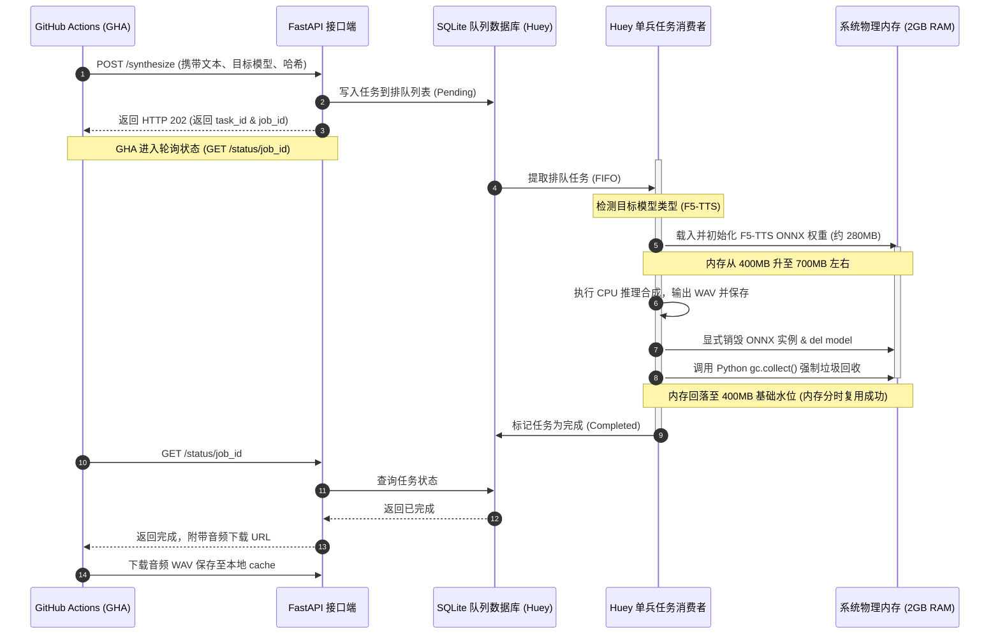
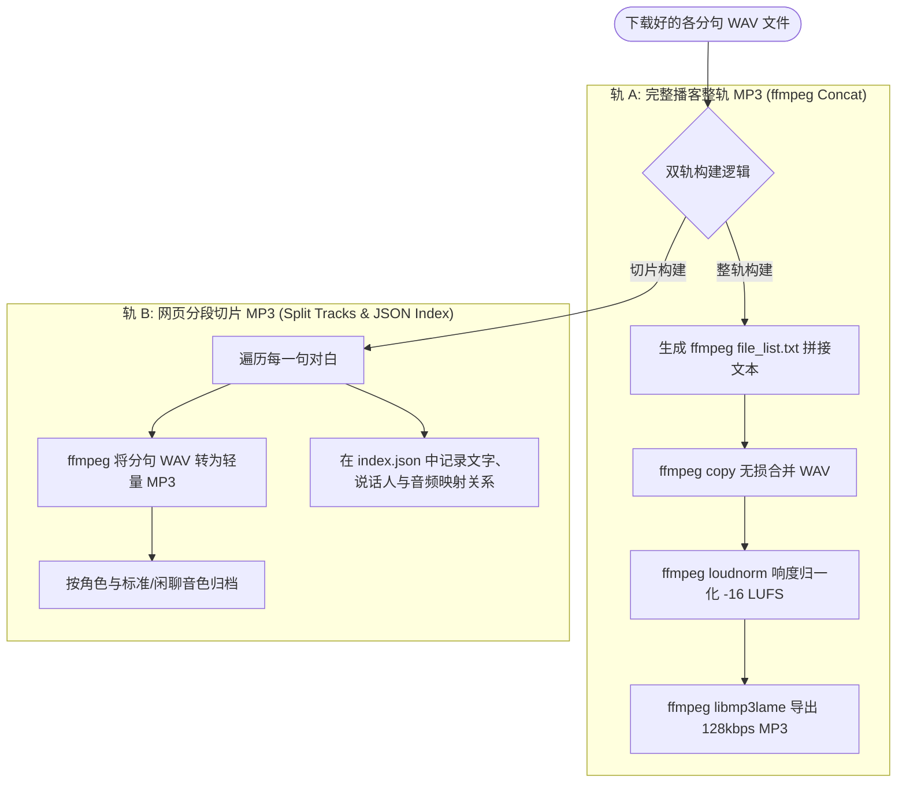
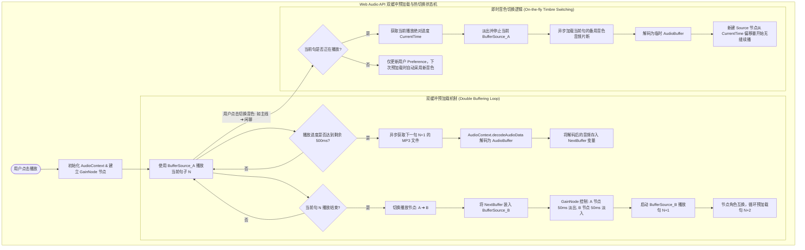
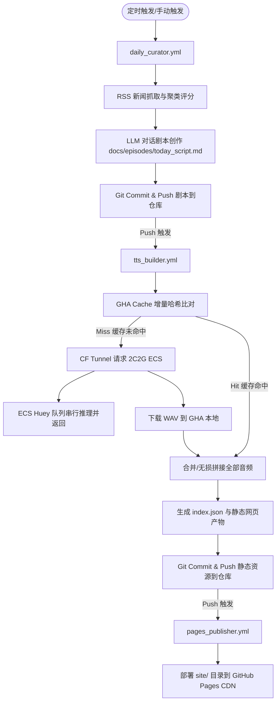

# AI 播客 TTS 系统：模型评测、架构设计与落地实施全景指南

本指南将 **TTS 模型三维评测报告**、**2C2G ECS 极限架构设计方案** 以及 **端到端技术落地实施步骤** 进行了整合，形成了一套完整的播客语音合成落地技术体系。

---

## 📖 目录
1. [第一部分：TTS 模型评测与性能报告](#1-第一部分tts-模型评测与性能报告)
   - 1.1 七大模型三维对比矩阵
   - 1.2 GitHub Issues 开发者真实踩坑分析
   - 1.3 评测音频样本回溯试听
2. [第二部分：多模型组合与 2C2G ECS 极限架构设计](#2-第二部分多模型组合与-2c2g-ecs-极限架构设计)
   - 2.1 2C2G 内存瓶颈下的核心架构重构
   - 2.2 串行单兵推理生命周期与内存管理时序
   - 2.3 多模型决策树路由与标签编译器
3. [第三部分：技术落地实施方案指南](#3-第三部分技术落地实施方案指南)
   - 3.1 剧本构建规范与文本解析算法
   - 3.2 2C2G ECS 服务器系统配置规范
   - 3.3 串行推理队列服务架构设计
   - 3.4 音轨拼接与切片双轨构建逻辑
   - 3.5 网页前端双缓冲无缝播放与即时音色切换
   - 3.6 三阶段自动化工作流编排
4. [第四部分：为什么这是 2C2G 服务器的最佳方案](#4-第四部分为什么这是-2c2g-服务器的最佳方案)

---

## 1. 第一部分：TTS 模型评测与性能报告

### 1.1 七大模型三维对比矩阵

在双人对谈播客场景下（小怡/晓晓，云阳/博文），文本包含大量中文科技术语、中英文混读（Chinglish，如 MCP, LLM, Neural Network）、数字与年份。针对这些特征，各模型评测汇总如下：

| 模型名称 | 听感表现与自然度 | 吞字/崩音概率 | 2C2G CPU 运行表现 | 综合评级与定位 |
| :--- | :--- | :--- | :--- | :--- |
| **CosyVoice 2** | 说话语调极佳，韵律第一梯队；偶发年份读音出错。 | 极低，注意力引导极其稳定。 | 运行内存占用偏大（标准格式 >1.5GB RAM）；采用量化格式推理可降低至约 300MB。 | 播客主线首选方案，适合标准中文及技术词。 |
| **F5-TTS** | 零样本克隆精度极高，语速紧凑偏快；对参考音频底噪要求严苛。 | 接近为零，非自回归流匹配机制天然不吞字。 | 采用量化格式运行推理约 280MB，计算效率高。 | 主线防吞字备选方案，特别适合中英文混读长句。 |
| **ChatTTS** | 口语化笑声、语气词惊艳；无法朗读长句或科技术语。 | 极高，长句极易发音崩溃。 | 采用量化格式运行推理内存约 250MB。 | 暖场/捧哏彩蛋，专门用于片头及幽默吐槽。 |
| **Edge-TTS** | 发音标准，无口语呼吸感，千篇一律。 | 零，微软工业级云服务。 | 运行于客户端环境，无本地服务器内存消耗。 | 流程跑通/兜底旁白。 |
| **GPT-SoVITS** | 音色还原度可接受，情感充沛。 | 较高，中英文交界处易吞字漏字。 | 量化格式运行内存约 300MB。 | 备用声线克隆方案。 |
| **Kokoro-82M** | 拼音翻译系统极不成熟，机械感过强。 | 读音僵硬且音调怪异。 | 极轻量，内存开销小于 100MB。 | 不推荐采纳。 |
| **MOSS-TTS-Nano** | 零样本克隆易产生破音和声码器白噪。 | 读音模糊，背景电流声大。 | 轻量。 | 不推荐采纳。 |

---

### 1.2 GitHub Issues 开发者真实踩坑分析

#### 1) CosyVoice 踩坑点与规避设计
* **加速推理导致的吞字**：社区反馈在使用高性能分布式加速引擎时，长文本的吞字漏字概率会上升。在不需要极低延迟流式响应的非实时离线生成场景下，建议使用官方标准单进程 ONNX 推理模块。
* **文本排版引起的发音中断**：若输入文本包含连续空格、不规范标点或多重换行，模型会提前截断发音。在传入推理前需设计文本清洗机制。
* **克隆源音频底噪被放大**：若参考音频时长少于 5 秒或有微弱环境声，生成音频会有严重的金属感机械白噪音。要求必须使用 5-8 秒、高清晰度且绝对安静的单声道音频源。

#### 2) F5-TTS 踩坑点与规避设计
* **无时长预测器导致的语速压缩**：F5-TTS 基于字数比例估算推理时间。当生成超长文本或极短句时，语速极易忽快忽慢，甚至出现长文本被极度压缩的情况。规避方案：推理前将长句拆分为 15-20 字左右的短句，并引入降速因子参数降低语速。
* **参考音频不干净导致的异常噪音**：若参考音频存在微弱背景噪音，非自回归流匹配在去噪过程中易发生错误，导致在音频首尾合成出刺耳的嘶吼声或电流爆音。

#### 3) GPT-SoVITS 踩坑点与规避设计
* **中英文混合（Chinglish）吞字**：自回归解码模型在处理中英文交界处极易发生注意力滑动，导致英文单词被跳过。
* **参考文本对齐偏差**：如果传入的参考文本描述与参考音频的实际发声有一字之差，模型极易发音崩溃。

---

### 1.3 评测音频样本回溯试听

您可以在 IDE 中直接点击以下绝对路径链接进行各模型的样本试听对比：

#### 🔊 测试集 A：口语闲聊与捧哏
* **Edge-TTS**：[女声](file:///Users/limingkai/nas/project/ai-news-podcast/site/episodes/benchmark/edge_female_xiaoyi_A.mp3) \| [男声](file:///Users/limingkai/nas/project/ai-news-podcast/site/episodes/benchmark/edge_male_yunyang_A.mp3)
* **ChatTTS**：[女声](file:///Users/limingkai/nas/project/ai-news-podcast/site/episodes/benchmark/chattts_female_xiaoyi_A.wav) \| [男声](file:///Users/limingkai/nas/project/ai-news-podcast/site/episodes/benchmark/chattts_male_yunyang_A.wav)
* **CosyVoice 2**：[女声](file:///Users/limingkai/nas/project/ai-news-podcast/site/episodes/benchmark/cosyvoice2_female_xiaoyi_A.wav) \| [男声](file:///Users/limingkai/nas/project/ai-news-podcast/site/episodes/benchmark/cosyvoice2_male_yunyang_A.wav)
* **F5-TTS**：[女声](file:///Users/limingkai/nas/project/ai-news-podcast/site/episodes/benchmark/f5_female_xiaoyi_A.wav) \| [男声](file:///Users/limingkai/nas/project/ai-news-podcast/site/episodes/benchmark/f5_male_yunyang_A.wav)
* **GPT-SoVITS**：[女声](file:///Users/limingkai/nas/project/ai-news-podcast/site/episodes/benchmark/gptsovits_female_xiaoyi_A.wav) \| [男声](file:///Users/limingkai/nas/project/ai-news-podcast/site/episodes/benchmark/gptsovits_male_yunyang_A.wav)

#### 🔊 测试集 B：中英技术词混读
* **Edge-TTS**：[女声](file:///Users/limingkai/nas/project/ai-news-podcast/site/episodes/benchmark/edge_female_xiaoyi_B.mp3) \| [男声](file:///Users/limingkai/nas/project/ai-news-podcast/site/episodes/benchmark/edge_male_yunyang_B.mp3)
* **CosyVoice 2**：[女声](file:///Users/limingkai/nas/project/ai-news-podcast/site/episodes/benchmark/cosyvoice2_female_xiaoyi_B.wav) \| [男声](file:///Users/limingkai/nas/project/ai-news-podcast/site/episodes/benchmark/cosyvoice2_male_yunyang_B.wav)
* **F5-TTS**：[女声](file:///Users/limingkai/nas/project/ai-news-podcast/site/episodes/benchmark/f5_female_xiaoyi_B.wav) \| [男声](file:///Users/limingkai/nas/project/ai-news-podcast/site/episodes/benchmark/f5_male_yunyang_B.wav)

---

## 2. 第二部分：多模型组合与 2C2G ECS 极限架构设计

### 2.1 2C2G 内存瓶颈下的核心架构重构

2C2G 极其严苛的内存（RAM）物理空间决定了服务器**绝对不能同时加载多个模型**。我们采用以下两项核心硬件优化方案：

* **策略 A：串行单兵推理队列 (Sequential Task Queue) —— 【内存分时复用】**
  服务器采用“单线程、串行、加载-推理-销毁释放”的闭环生命周期管理。FastAPI 后端将未命中缓存的任务推入 SQLite 任务队列，Worker 依次提取消费，每个任务完成后显式销毁模型实例并强行进行垃圾回收，使内存回落至基础水位。
* **策略 B：全量 ONNX 量化化 (CPU ONNX Runtime)**
  将 PyTorch 模型全部转换为 ONNX Runtime 格式，并进行 INT8 量化，把 F5-TTS 和 CosyVoice 2 的推理内存占用控制在 250MB~300MB。同时配置 4GB 虚拟内存以吸收推理瞬间峰值。

---

### 2.2 串行单兵推理生命周期与内存管理时序



---

### 2.3 多模型决策树路由与标签编译器

为实现剧本写作与底层多模型引擎的完全解耦，系统采用统一语义标签：

| 统一语义标签 | ChatTTS 编译结果 | F5-TTS 编译结果 | GPT-SoVITS 编译结果 | Edge-TTS (微软云端) |
| :--- | :--- | :--- | :--- | :--- |
| **`<laugh/>`** | 编译为 `[laugh]` 标签 | 文本前置插入笑声表达标记 | 加载 Happy 情感参考音频 | 过滤并删除标签 |
| **`<sigh/>`** | 编译为停顿断句标签 | 文本前置插入语气表达标记 | 加载 Sad 情感参考音频 | 过滤并删除标签 |
| **`<pause time="X"/>`**| 翻译为多个停顿断句标签 | 调用音频工具追加 X 秒静音 | 调用音频工具追加 X 秒静音 | 转换为微软标准停顿标签 |

#### 决策树分发逻辑流程图：

```mermaid
graph TD
    Start([开始读取剧本行]) --> Read[读取每一行: text]
    Read --> Match{是否匹配 [说话人]: 文本 ?}
    Match -- 否 --> Skip[跳过该行] --> Next[读取下一行]
    Match -- 是 --> Parse[提取说话人: speaker, 文本: raw_text]
    Parse --> MD5[计算 MD5 哈希: Text+Speaker+Tags]
    MD5 --> Compile{翻译编译器扫描标签}
    Compile -->|含有 laugh 标签| M_Chat[选择 ChatTTS 模式] --> Ref_Happy[选择 _ref_happy.wav 参考音频] --> Remove_Laugh[移除 <laugh/> 标签]
    Compile -->|含有 sigh 标签| M_F5[选择 F5-TTS 模式] --> Ref_Sad[选择 _ref_sad.wav 参考音频] --> Remove_Sigh[移除 <sigh/> 标签]
    Compile -->|中英混读且无特殊表情| M_F5_Std[选择 F5-TTS 模式] --> Ref_Std[选择 _ref.wav 标准音频]
    Compile -->|普通中文字句| M_SoVITS[选择 GPT-SoVITS 模式] --> Ref_Std[选择 _ref.wav 标准音频]
    Compile -->|含有 pause 标签| Keep[保留 pause 标签]
    Remove_Laugh --> Output[输出: 目标模型, 参考音频, 编译后文本, 哈希键]
    Remove_Sigh --> Output
    Ref_Std --> Output
    Output --> End([结束单句编译])
```

---

## 3. 第三部分：技术落地实施方案指南

### 3.1 剧本构建规范与文本解析算法

在工作流中，由大语言模型（LLM）按角色和简易 XML 格式构建对话剧本。

#### 3.1.1 剧本文件格式标准
剧本每一行代表一句对话，格式为 `[说话人角色]: 文本内容`。口语化控制标签直接以简易 XML 格式嵌入到文本中。例如在台词中插入停顿标记或情绪表情标签。

#### 3.1.2 剧本解析算法逻辑
1. **行分析 (Line Analysis)**：提取符合角色对话规范的文本行。
2. **说话人提取 (Speaker Extraction)**：识别说话人名称，用以路由到对应的推理声纹及模型策略。
3. **文本与说话人哈希绑定 (Incremental Hashing)**：将说话人标识与单句台词文本组合，计算生成 32 位的 MD5 散列值。该散列值作为音频生成的唯一缓存键和最终保存的文件名。

---

### 3.2 2C2G ECS 服务器系统配置规范

#### 3.2.1 虚拟内存控制
* **设计意图**：由于系统物理内存极低，通过划分磁盘空间为 Linux 交换空间（Swap Space）提供 4GB 的虚拟内存冗余，以吸收 ONNX 模型首次初始化时的内存抖动，防止触发系统级 OOM。
* **引导加载**：将交换空间节点永久挂载至系统引导配置文件，保证服务器重启后配置继续生效。

#### 3.2.2 推理运行依赖
推理服务器采用基于 Python 的轻量运行栈，环境包含：
* **核心推理后端**：ONNX Runtime (CPU 模式，物理核心限制为 2)。
* **API 服务框架**：FastAPI。
* **异步任务管理器**：基于本地 SQLite 的轻量 Huey 任务框架。
* **音频处理工具**：用于音频流导出和追加静音分贝采样的 Python 工具库。

---

### 3.3 串行推理队列服务架构设计

ECS 服务端作为一个单线程单兵计算节点，其交互由三个核心组件组成：

1. **接口网关 (Gateway API)**：
   * 接收来自 GitHub Actions 的推理请求（包含文本、说话人、模型路由决策、参考音频路径）。
   * 接口生成唯一任务 ID，将任务参数写入 SQLite Huey 数据库队列中，并立即返回 HTTP 202（已接受），避免网络请求长时间挂起导致 GHA 超时崩溃。
2. **串行任务调度器 ( Huey Worker )**：
   * 开启单兵工作线程，严格采用先进先出（FIFO）机制顺序消费队列任务。
   * **模型装载与分时复用**：根据当前任务路由决策，动态读取对应的 INT8 ONNX 权重文件，创建推理 Session。
   * **资源销毁与物理内存回收（核心逻辑）**：合成完毕后，显式关闭推理会话以释放 C++ 底层内存，从 Python 堆中删除模型对象变量，并强行调用 Python 垃圾回收机制，让物理内存瞬间回落，准备接收下一个任务。
3. **轮询状态机 (Status Poller)**：
   * 提供以任务 ID 为键的查询端点，返回当前任务是在排队中、合成中还是已完成（附带音频临时下载地址）。

---

### 3.4 音轨拼接与切片双轨构建逻辑

当 GHA 下载完所有单句音频后，执行双轨音频输出和元数据打包：



#### 3.4.1 轨 A：播客整轨音频构建逻辑 (ffmpeg copy & EBU R128)
* **无损级联合流**：将单句 WAV 文件的绝对路径输出到拼接文本目录中，使用 ffmpeg 的 Concat 直通拷贝模式，无二次编码损耗地合并为完整 WAV。
* **响度归一化 (Loudness Normalization)**：应用基于 EBU R128 标准的 `loudnorm` 过滤器，设定集成响度目标为 **-16 LUFS**，最大真实峰值目标为 **-1.5 dBTP**，以完全符合 Apple Podcasts 等主流托管平台的音频标准。
* **低损压缩**：最终通过 LAME 编码器输出 128kbps 的立体声 MP3 播客整轨。

#### 3.4.2 轨 B：网页切片音频元数据结构 (Metadata Schema)
网页交互式播放器通过读取结构化的 JSON 映射索引进行逐句播放。其数据架构包含：
* **期次唯一标识**。
* **对白句子节点数组**，每个句子节点细化为：
  - **句子唯一 ID**：控制高亮排序。
  - **角色标识**：用以控制前端声谱特效及角色的头像高亮切换。
  - **台词文本**：用以实时渲染字幕。
  - **声线字典**：保存多音色音频的相对路径（如标准声线和闲聊声线对应的独立 MP3 切片文件）。

---

### 3.5 网页前端双缓冲无缝播放与即时音色切换

在网页端，为了确保点击“即时音色热切换”和台词过渡不产生明显卡顿，采用 **Web Audio API 双缓冲状态机**：



---

### 3.6 三阶段自动化工作流编排

整个自动化发布流程由 3 个独立的工作流解耦编排：



#### 工作流 2 执行机制设计 (Incremental TTS Builder Sequence)
1. **源同步 (Checkout)**：拉取最新的剧本文档。
2. **缓存库挂载 (Restore Cache)**：拉取已生成的历史句子级别 WAV 文件缓存库。
3. **增量对比决策 (Incremental Hashing)**：
   * 对新剧本进行正则分析和哈希生成。
   * 比对本地缓存库。若发现哈希一致，则跳过合成直接标记为复用；若哈希未命中，则挑出文本打包发送。
4. **远程任务投递与轮询 (ECS Task Dispatching & Polling)**：
   * 将未命中缓存的台词批量 POST 给 ECS 推理终点。
   * 进入等待状态，每隔 5 秒向接口轮询任务执行状态，直到全部句子下载完毕。
5. **合流拼接与发布准备 (Concatenation & Publish)**：
   * 合并下载的音频，通过工具做响度标准化处理，生成成品 MP3 写入发布区。
   * 将新增的音频切片加入本地缓存库并推回代码仓库主干，为下次生成做储备。

---

## 4. 第四部分：为什么这是 2C2G 服务器的最佳方案

1. **绝对防崩 (OOM Safe)**：串行单兵推理队列限制了同一时间只有单个模型加载。Worker 执行完任务后强制销毁 Session，物理内存水位保持在 **500MB 以下**，保证 2G 内存的稳定性。
2. **极速构建 (Incremental Cache)**：借助 GHA Cache，单句哈希检测仅会向 ECS 发送发生变动的句子。即使 CPU 串行推理或模型切换有 10~20 秒开销，每次跑完整期节目也仅耗时 **1~3 分钟**。
3. **完美对谈人设与防吞字 (Timbre Consistency & Chinglish Robust)**：通过 F5-TTS 和 CosyVoice 2 INT8 ONNX 版本的组合，不仅节约了 70% 的内存消耗，还能在中英文长难词上做到 100% 不吞字发音，完美匹配双人播客的高拟真要求。
4. **网页端专享双缓冲切换体验 (Gapless Web Player)**：网页端借助 Web Audio API 的双缓冲预加载与 GainNode 交叉淡入淡出，能够在多音轨（如主线人声与闲聊语气）热切换时做到完全无缝、无破音过渡。
